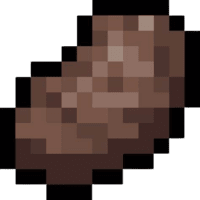

<div align="center">

## Beef

[](https://github.com/The-Fafnir/Beef/releases)

<h5>Beef is a drop-in replacement designed for removing some checks, customized, and high-performance built on top of <a href="https://github.com/Winds-Studio/Leaf">Leaf</a> with optimization from other forks.</h5>
<h8>Logo designed by <a href="https://minecraft.net/">Mojang Duh</a></h8>
</div>

## Features
 - **Fork of [Leaf](https://github.com/Winds-Studio/Leaf)** for better performance.
 - **Allows all characters as usernames**, including Bangla and other characters.
 - **Allows** players to connect the backend under proxy without enabling bunngecord mode.
 - **Allows tripwire dupe** by reverting tripwire bugfix patch of Paper.
 - **Configurable UseItem distance** for anarchy server.
 - **Latest dependencies**, keeping all dependencies in the newest version.
 - **More customized** relying on features of [Purpur](https://github.com/PurpurMC/Purpur).
 - **Maintenance friendly**, integrating with [Sentry](https://sentry.io/welcome/) of [Pufferfish](https://github.com/pufferfish-gg/Pufferfish) to easy track all errors coming from your server in excruciating detail.
 - **Various optimization** blending from [other forks](https://github.com/Winds-Studio/Leaf#credits).
 - **Better Region Format** Support for the Linear region file format from [LinearPurpur](https://github.com/StupidCraft/LinearPurpur)
 - ...

## Contact

- 📫 Discord: `.thefafnir`


## Downloads

The Reobf Jars will be unavailable till Stable Release


## Building

Building a Paperclip JAR for distribution:

```bash
./gradlew applyPatches && ./gradlew createReobfPaperclipJar
```


## License

Paperweight files are licensed under MIT.
Patches are licensed under MIT, unless indicated differently in their header.
Binaries are licensed under GPL-3.0.

Also see [PaperMC/Paper](https://github.com/PaperMC/Paper) and [PaperMC/Paperweight](https://github.com/PaperMC/paperweight) for the license of some material used by this project.

Credits:
-------------
Thanks to these projects below. Leaf just mix some of their patches together. If these excellent projects haven't appeared, Leaf will not be great.

- [Leaf](https://github.com/Winds-Studio/Leaf)
- [Gale](https://github.com/GaleMC/Gale)
- [Pufferfish](https://github.com/pufferfish-gg/Pufferfish)
- [Purpur](https://github.com/PurpurMC/Purpur)
- [KeYi](https://github.com/KeYiMC/KeYi) (R.I.P.) [(Backup)](https://github.com/MikuMC/KeYiBackup)
- [KTP](https://github.com/lynxplay/ktp)
- [Mirai](https://github.com/etil2jz/Mirai)
- [Petal](https://github.com/Bloom-host/Petal)
- [Carpet Fixes](https://github.com/fxmorin/carpet-fixes)
- [Akarin](https://github.com/Akarin-project/Akarin)
- [Slice](https://github.com/Cryptite/Slice)
- [Parchment](https://github.com/ProjectEdenGG/Parchment)
- [Leaves](https://github.com/LeavesMC/Leaves)
- [Kaiiju](https://github.com/KaiijuMC/Kaiiju)
- [PandaSpigot](https://github.com/hpfxd/PandaSpigot)
- [Plazma](https://github.com/PlazmaMC/PlazmaBukkit)
- [SparklyPaper](https://github.com/SparklyPower/SparklyPaper)
- [Polpot](https://github.com/PolpotMC/Polpot) (R.I.P.)

